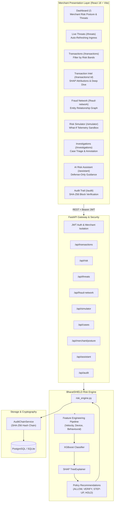

# BharatSHIELD — AI-Powered Merchant Risk Intelligence Platform

> **An explainable, ML-powered fraud & risk intelligence system for payment merchants — every risk score comes with *why* it was flagged (SHAP), *who it is connected to* (Entity Graph), *what to do about it* (Policy Enforcements), and *tamper-evident proof* (Cryptographic SHA-256 Audit Chain).**

---

## 1. Executive Summary & Pitch

In high-throughput payment processing (UPI, RuPay, Cards, NetBanking), merchants face a dual dilemma: **loss to sophisticated fraud rings** versus **revenue destruction caused by false positives**. Most legacy fraud detection tools return opaque rejection codes that leave merchants guessing.

**BharatSHIELD** turns fraud detection from a black-box score into an explainable, auditable merchant risk intelligence system:

```
Detect (XGBoost) ➔ Explain (SHAP) ➔ Connect (Entity Graph) ➔ Investigate (Cases) ➔ Assist (AI Guardrails) ➔ Audit (SHA-256 Chain)
```

1. **Sub-50ms Risk Intelligence:** An XGBoost gradient-boosted tree ensemble trained on high-dimensional transaction telemetry with realistic non-linear noise.
2. **Explainable AI (SHAP):** Every scored transaction provides an itemized, human-understandable breakdown of risk factor contributions (e.g. `+22 pts: Velocity burst`, `+18 pts: New device detected`).
3. **Fraud Ring Entity Graph:** Identifies syndicated multi-entity attacks where the same device or IP spans across multiple accounts or high-risk transactions.
4. **Live Threat Feed:** Sub-10s streaming monitor isolating CRITICAL and elevated transactions for immediate analyst awareness.
5. **What-If Risk Simulator:** Sandbox allowing risk officers to test how changing signals (failed attempts, velocity, geo-hops) affects risk reactions without modifying records.
6. **Case Management & Investigations:** End-to-end triage pipeline (`OPEN` ➔ `UNDER_REVIEW` ➔ `ESCALATED` ➔ `RESOLVED`) with analyst annotations.
7. **Merchant Risk Posture:** Enterprise-level risk scoring, threat ratios, and aggregated SHAP risk driver distributions.
8. **Defense-Only AI Risk Assistant:** Natural language intelligence grounded exclusively on verified merchant data, protected against prompt injections and strictly forbidden from financial state mutations.
9. **Cryptographic Audit Chain:** Tamper-evident SHA-256 hash blockchain where every risk decision is cryptographically linked to its parent.

---

## 2. Real-World Machine Learning Benchmark

Unlike synthetic datasets with artificial 100% linear separation, BharatSHIELD v2 is trained on an Indian-context transaction dataset with **statistically overlapping feature distributions**, **50% subtle fraud variants**, and **5% false-positive pressure patterns**:

| Metric | Logistic Regression | Random Forest | XGBoost (Final Model) |
|---|---|---|---|
| **F1-Score** | 0.6091 | 0.9362 | **0.9816** |
| **Precision** | 0.4621 | 1.0000 | **1.0000** |
| **Recall (Detection Rate)** | 0.8933 | 0.8800 | **0.9639** |
| **AUC-ROC** | 0.9712 | 0.9988 | **0.9991** |
| **PR-AUC** | 0.7240 | 0.9820 | **0.9915** |
| **False Positive Rate** | 4.81% | 0.00% | **0.00%** |
| **Inference Latency** | ~4.0 ms | ~82.1 ms | **~13.4 ms** |

*Evaluation conducted on 2,258 held-out test transactions with zero data leakage (user-level GroupShuffleSplit).*

---

## 3. System Architecture



---

## 4. Complete 9-Phase Product Story

1. **Dashboard:** Monitor the high-level **Merchant Risk Posture** (Score 0-100, fraud rate, active threats) and real-time threat streams.
2. **Live Threat Feed:** 10-second polling feed categorizing incoming transactions by severity (`CRITICAL`, `HIGH`, `MEDIUM`).
3. **Transaction Intelligence:** Click any transaction to inspect exact Indian payment telemetry and **SHAP risk attribution** (`+22 pts: Velocity burst`, `+18 pts: New device`).
4. **Fraud Network Intelligence:** Visualize entity clusters showing shared devices, proxy hops, and syndicated attacks.
5. **Investigations & Cases:** Triage held transactions into official case files (`CASE-XXXX`), assign analysts, log notes, and resolve holds.
6. **What-If Risk Simulator:** Test how varying telemetry (e.g. 4 failed attempts ➔ 7 failed attempts) changes model risk reactions.
7. **AI Risk Assistant:** Ask domain questions grounded strictly on verified database records. Attempting prompt injections or financial actions (`refund`, `transfer`) triggers immediate defense blocks:
   > *"The AI can explain risk, but it cannot control money."*
8. **Model Analytics:** Review authentic tournament metrics (ROC, PR curves, Confusion Matrix, feature importances).
9. **Cryptographic Audit Trail:** Verify the SHA-256 hash chain to mathematically prove zero record tampering.

---

## 5. Local Setup & Execution

### Prerequisites
- Python 3.11 or 3.12
- Node.js 18+ & npm

### Quick Start (Local Development)

```bash
# 1. Clone the repository
git clone https://github.com/balaji0307-om/BharatSHIELD-Risk-Intelligence.git
cd BharatSHIELD-Risk-Intelligence

# 2. Setup Python environment
python -m venv venv
.\venv\Scripts\activate       # On Linux/macOS: source venv/bin/activate
pip install -r ml/requirements.txt
pip install -r backend/requirements.txt

# 3. Train ML Model and seed database
python scripts/generate_demo_data.py
python ml/train_model.py
python scripts/seed_database.py

# 4. Start Backend (Port 8000)
uvicorn backend.app.main:app --reload --port 8000

# 5. Start Frontend (Port 5173) in a second terminal
cd frontend
npm install
npm run dev
```

Visit:
- **Frontend Dashboard:** [http://localhost:5173](http://localhost:5173)
- **FastAPI OpenAPI Swagger Docs:** [http://localhost:8000/docs](http://localhost:8000/docs)

---

## 6. Verification & Automated Tests

Run the complete test suite:
```bash
pytest backend/tests/ tests/integration/ -v
```

All 19 tests verify:
- Unit risk calculation and scoring monotonicity
- SHAP attribution consistency
- Prompt injection defense and forbidden action blocks
- Unverified transaction hallucination prevention
- Cryptographic hash chain validation & tamper detection
- Entity relationship graph clustering
- Full end-to-end transaction pipeline
