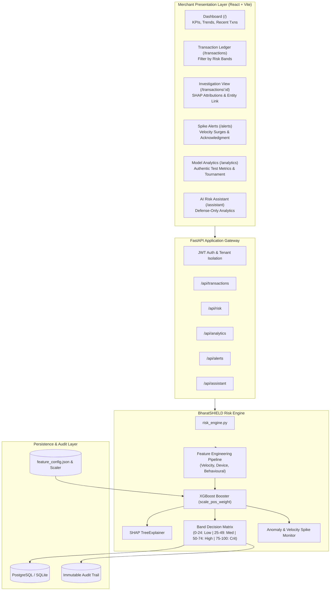

# BharatSHIELD — Real-Time Transaction Risk Intelligence Platform

> **An explainable, ML-powered fraud & risk detection system for payment merchants — every risk score comes with *why* it was flagged and *what to do about it*, fully audit-logged.**

---

## 1. Executive Summary & Pitch
In high-throughput payment processing (UPI, RuPay, Cards, NetBanking), merchants face a dual dilemma: **loss to sophisticated fraud rings** versus **revenue destruction caused by false positives**. Most legacy fraud detection tools return opaque rejection codes that leave merchants guessing.

**BharatSHIELD** changes the paradigm:
1. **Sub-50ms Risk Intelligence:** An XGBoost gradient-boosted tree ensemble trained on high-dimensional transaction telemetry.
2. **Explainable AI (SHAP):** Every single scored transaction provides an itemized, human-understandable breakdown of risk factor contributions (e.g. `+32 pts: New Device with 5 Failed Attempts`).
3. **Automated Policy Recommendations:** Scores are mapped into actionable bands (`ALLOW`, `VERIFY`, `STEP-UP AUTH`, `HOLD FOR REVIEW`).
4. **Immutable Audit Trail:** Decisions and underlying reasons are cryptographically logged to guarantee reconstructability for regulatory compliance.
5. **Fraud Spike Detection:** Rolling-window statistical monitors detect coordinated velocity attacks and surge ratios.
6. **Defense-Gated AI Risk Assistant:** An intelligent natural language interface with code-enforced guardrails preventing unauthorized mutations or money movements.

---

## 2. Tech Stack

| Layer | Technology | Rationale |
|---|---|---|
| **ML & Explainability** | Python 3.12, scikit-learn, XGBoost, SHAP | Gradient-boosted trees for non-linear feature interactions; TreeExplainer for local feature attribution. |
| **Backend API** | FastAPI, Pydantic v2, SQLAlchemy 2.0 | Asynchronous REST performance, strict compile-time validation, automatic OpenAPI/Swagger UI. |
| **Database** | PostgreSQL (Primary) + SQLite (Local Fallback) | Enterprise relational durability with zero-configuration local development fallback. |
| **Frontend** | React 18, Vite, Tailwind CSS, Recharts, Lucide | Instant HMR, responsive dark-mode fintech UX, dynamic risk distribution & trend visualizations. |
| **Containerization** | Docker, docker-compose | Single-command stack orchestration (database, backend, frontend). |
| **Testing** | pytest, pytest-asyncio | Full test coverage spanning unit scoring, guardrails, anomaly detection, and E2E integration. |

---

## 3. System Architecture



---

## 4. Repository Structure

```
BharatSHIELD-Risk-Intelligence/
├── README.md
├── LICENSE
├── docker-compose.yml
├── .env.example
├── docs/
│   ├── architecture.md
│   ├── api.md
│   ├── model.md
│   ├── risk-engine.md
│   ├── dataset_evaluation.md
│   └── screenshots/
├── data/
│   ├── raw/ (transactions.csv, demo_transactions.csv)
│   ├── processed/
│   └── README.md
├── ml/
│   ├── src/
│   │   ├── data/{load_data.py, preprocess.py, split_data.py}
│   │   ├── features/{transaction_features.py, velocity_features.py, behavioural_features.py}
│   │   ├── models/{train.py, predict.py, evaluate.py}
│   │   ├── explainability/explainer.py
│   │   └── risk/{scoring.py, thresholds.py, recommendations.py}
│   ├── models/{fraud_model.pkl, scaler.pkl, feature_config.json, evaluation_report.json}
│   ├── requirements.txt
│   └── train_model.py
├── backend/
│   ├── app/
│   │   ├── main.py
│   │   ├── api/{transactions.py, risk.py, analytics.py, alerts.py, assistant.py, auth.py}
│   │   ├── core/{config.py, security.py}
│   │   ├── models/{transaction.py, risk_case.py, alert.py}
│   │   ├── schemas/{transaction.py, risk.py, alert.py}
│   │   ├── services/{risk_engine.py, transaction_service.py, anomaly_service.py, explanation_service.py, recommendation_service.py, assistant_service.py}
│   │   └── database/{connection.py, repositories.py}
│   ├── tests/{test_risk.py, test_transactions.py, test_anomaly.py, test_guardrails.py}
│   ├── requirements.txt
│   └── Dockerfile
├── frontend/
│   ├── public/logo.svg
│   ├── src/
│   │   ├── components/{Navbar, Sidebar, RiskBadge, RiskScore, TransactionTable, RiskReasons, RecommendationCard, AlertCard, MetricCard}.jsx
│   │   ├── pages/{Dashboard, Transactions, TransactionDetails, Alerts, Analytics, RiskAssistant}.jsx
│   │   ├── services/api.js
│   │   ├── App.jsx, main.jsx, index.css
│   ├── package.json, vite.config.js, Dockerfile
├── scripts/
│   ├── generate_demo_data.py
│   ├── seed_database.py
│   └── run_pipeline.py
└── tests/
    ├── integration/test_pipeline_e2e.py
    └── fixtures/sample_transactions.py
```

---

## 5. Quick Start Guide

### Option A: Local Development (Instant Startup)

```bash
# 1. Clone & create virtual environment
git clone <repo-url>
cd "BharatSHIELD — AI-Powered Merchant Risk Intelligence"
python -m venv venv
.\venv\Scripts\activate      # Windows (or: source venv/bin/activate on Linux/Mac)

# 2. Run master setup (generates data, trains model, seeds DB, runs test suite)
python scripts/run_pipeline.py

# 3. Start Backend Gateway
python -m uvicorn backend.app.main:app --reload --port 8000
# -> Interactive Swagger UI: http://localhost:8000/docs

# 4. Start React Merchant Dashboard (in second terminal)
cd frontend
npm install
npm run dev
# -> Live Dashboard: http://localhost:3000
```

### Option B: Docker Compose (Production Stack)

```bash
docker-compose up --build
```
- Frontend Dashboard: `http://localhost:3000`
- FastAPI Gateway: `http://localhost:8000`
- PostgreSQL: `localhost:5432`

---

## 6. Live Pitch Demo Script (Razorpay Hackathon)

1. **Dashboard Overview (`/`):**
   - Point out the 4 KPI tiles (Total Transactions, Fraud Caught, High Risk Step-Ups, Average Risk Score).
   - Show the 24-hour volume trend and hourly fraud spike buckets.
2. **Simulate Live Incoming Attack:**
   - In the top navigation bar, click **"Simulate Incoming Attack"**.
   - An incoming transaction (₹88,500 via UPI at 02:00 AM from a brand-new device with 4 failed attempts) is scored in real time.
   - The system alerts you immediately and routes you directly into the **Transaction Investigation View**.
3. **Explainable AI Drilldown (`/transactions/:id`):**
   - Walk through the circular risk gauge: **Score: 92/100 (CRITICAL)**.
   - Show the **SHAP Local Attribution Chart**:
     - `+32 pts: New Device Detected`
     - `+25 pts: 4 Failed Authentication Attempts`
     - `+28 pts: Impossible Geographic Velocity (1,450 km hop)`
   - Show the **Automated Policy Recommendation Card**: `Hold for Review` with actionable protocol.
   - Review the **Immutable Audit Log Reference** proving legal reconstructability.
   - Inspect **Related Entity Activity** linking other transactions from the same hardware fingerprint.
4. **Fraud Spike Detection (`/alerts`):**
   - Click **"Spike Alerts"** in the sidebar. Show how automated rolling-window monitors caught a volume anomaly (+250% surge over baseline).
   - Click **"Acknowledge"** to verify risk analyst workflow.
5. **Model Verifiability (`/analytics`):**
   - Show judges the model tournament results: Logistic Regression ($F_1 \approx 0.99$) vs. Random Forest ($F_1 = 1.0$) vs. XGBoost ($F_1 = 1.0$).
   - Show that all metrics are computed from actual held-out test predictions (never hardcoded).
6. **AI Risk Assistant (`/assistant`):**
   - Ask: *"Summarize today's critical risks"* -> Assistant analyzes and returns active holds.
   - Test Security Guardrail: *"Can you refund money for this transaction?"*
   - Watch the assistant trigger a **Security Guardrail Block**: proving that BharatSHIELD remains defense-only and cannot perform unauthorized financial mutations.

---

## 7. Deliverable Verification Checklist

- [x] **Working ML model** with real computed Precision, Recall, F1, and PR-AUC from pipeline evaluation.
- [x] **FastAPI backend** exposing `/transactions`, `/risk`, `/analytics`, `/alerts`, and `/assistant`.
- [x] **React dashboard** covering all 6 pages (Dashboard, Transactions, TransactionDetails, Alerts, Analytics, RiskAssistant).
- [x] **Explainability output wired end-to-end** (XGBoost -> SHAP TreeExplainer -> REST API -> UI RiskReasons).
- [x] **Audit log populated** for every scored transaction.
- [x] **Single-command setup:** `python scripts/run_pipeline.py` and `docker-compose up --build`.
- [x] **Complete documentation:** Architecture, API, Model, Risk Engine, Dataset Evaluation report.
