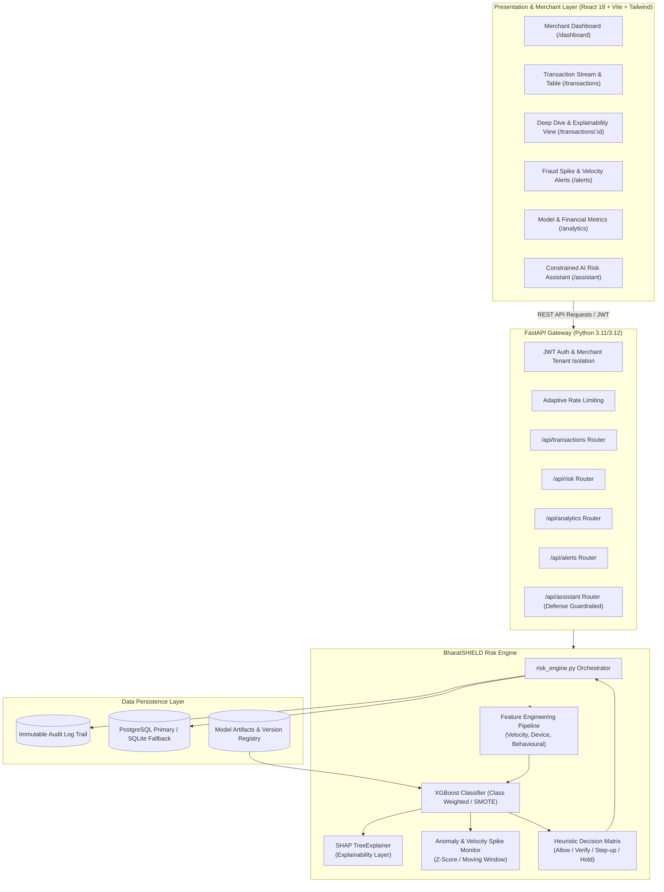

# BharatSHIELD Architecture Specification

## System Components

### 1. Presentation Tier (React + Vite)
- **Real-Time Visualization:** Recharts-driven risk score histograms, 24-hour volume trend, and merchant risk exposure charts.
- **Explainability Display:** Horizontal contribution bar chart directly visualizing positive and negative SHAP force values converted to plain language risk points.
- **Investigation Drilldown:** Detailed breakdown of device lineage, IP/geographic distance hops, velocity surges, and related merchant transactions.

### 2. Application & API Tier (FastAPI)
- Modular routers strictly segregated by business domain.
- Pydantic v2 schemas providing strict compile-time and runtime validation.
- Standardized error envelopes with request traceability.
- Asynchronous database operations with SQLAlchemy 2.0.

### 3. Intelligence Tier
- **Multi-Factor Feature Extractor:** Computes 5m, 10m, 1h velocity ratios, amount-to-historical deviation, and composite device trust scores.
- **Ensemble Classifier:** Optimized XGBoost model trained on class-imbalanced transaction telemetry.
- **SHAP Attribution:** Local feature attribution calculated via TreeExplainer on every incoming transaction inference pass.
- **Fraud Spike Monitor:** Rolling baseline z-score calculation comparing immediate merchant volume and high-risk ratios against historical averages.

### 4. Persistence & Audit Tier
- **Relational Stores:** `merchants`, `users`, `transactions`, `risk_scores`, `risk_factors`, `alerts`, `risk_cases`.
- **Immutable Audit Trail:** Append-only `audit_logs` storing original payload, raw score, computed explanation factors, recommended action, and decision timestamp.
